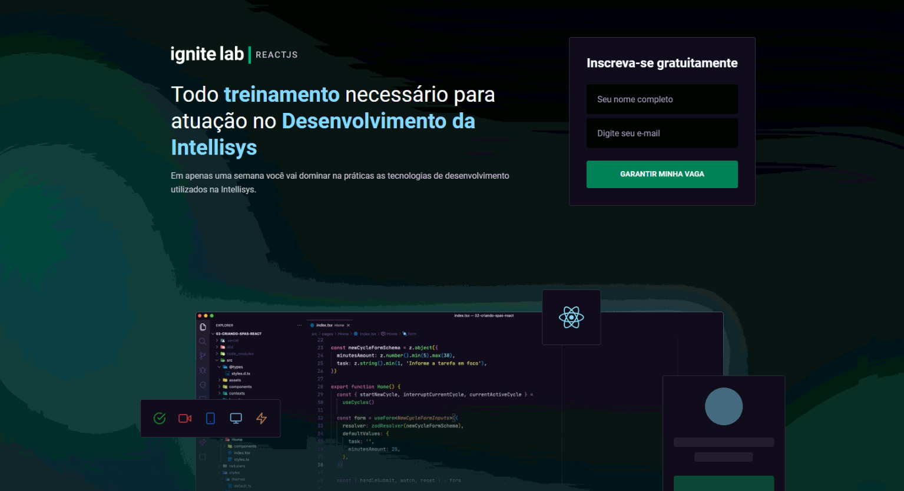

# Um projeto construído através da maratona Ignite Labs da @Rocketseat para treinar as tecnologias React, Typescript, GraphQL.

## Demonstração

## 🚀 Tecnologias utilizadas

O projeto foi desenvolvido utilizando as seguintes tecnologias

- [REACT]
- [TYPESCRIPT]
- [GRAPHQL]

## ✒ Autor

**Isaac Matos**

## 👥 Encontre-me nas redes sociais:

- 🌍 [Linkedin](https://www.linkedin.com/in/isaac-matos-568b6911a/)
- 🌍 [Twitter](https://twitter.com/ic_matos)

## ⚡ Projeto Online:
- [Link](https://intellisys-tutoriais.vercel.app)